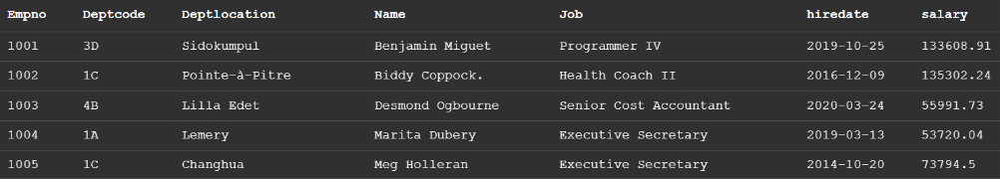

# normalization_process

dbms image 
##### 1.Identify all the candidate keys of the relation.
→ Empno
##### 2.Identify all the functional dependencies in the relation.
→ Empno -> Name,Job,hiredate,salary   
  &nbsp;&nbsp;&nbsp;&nbsp;Deptcode -> Deptlocation

##### 3.Examine the determinants of the functional dependencies. If any determinant is not a candidate key, the relation is not well formed  
Empno : ok | Deptcode : ng

##### 3a. Place the columns of the functional dependency in a new relation of their own.    
Department(Deptcode,DeptLocation)
##### 3b. Make the determinant of the functional dependency the primary key of the
new relation.  
Department(<u>Deptcode</u>,DeptLocation)

##### 3c. Leave a copy of the determinant as a foreign key in the original relation.  

Employee(Empno,Deptcode,Name,Job,hiredata,salary)
  
##### 3d.Create a referential integrity constraint between the original and the new
relation.  

Employee.Deptcode -> Department.Deptcode  

#### Final result
Employee(<u>Empno</u>,Deptcode,Name,Job,hiredata,salary)
Department(<u>Deptcode</u>,DeptLocation)

